# ReZero ResNet Unofficial Pytorch Implementation.

Trained a couple of nets for (fun) comparisons, using identical hyperparams and early stopping on validation accuracy plateau schedule. \
All experiments can be reproduced with the code from this repo using the default hyperparameters defined in `src/main.py`.

Check out the **ReZero paper** by the authors: https://arxiv.org/pdf/2003.04887.pdf \
Neat idea which seems to improve ResNet convergence speed, especially at the beggining of training (see figures).

## ReZero ResNet vs. ResNet on CIFAR-10:

| Model     | # params | runtime | epochs | Valid error (%) | Test error (%) |
|:-----------|:--------:|:--------:|:--------:|:-----------------:|:---------------------:|
| ResNet-20 | 272,474 | 70m3s | 398 | 7.63 | **7.98** |
| ResNet-56 | 855,770 | 127m41s | 281 | 6.04 | **6.44** |
| ResNet-110 | 1,730,768 | 240m53s | 313 | 6 | **6.39** |
| **ReZero** ResNet-20 | 272,483 | 63m9s | 327 |7.44 | **7.94** |
| **ReZero** ResNet-56 | 855,797 | 134m44s | 303 |6.31 | **6.55** |
| **ReZero** ResNet-110 | 1,730,714 | 301m19s | 410 |5.84 | **5.88** |

## Loss & Error curves:
**ResNet-20:**

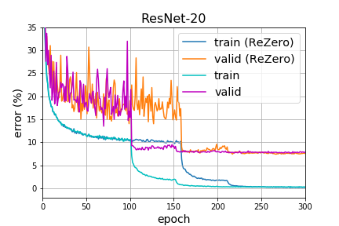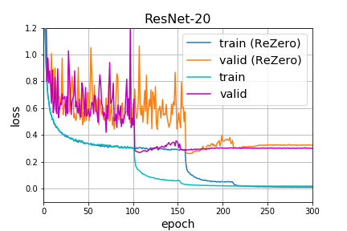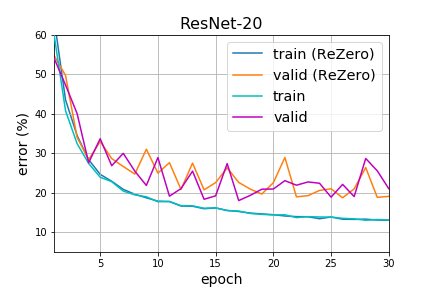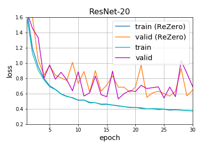

**ResNet-56:**

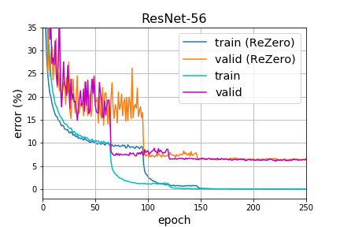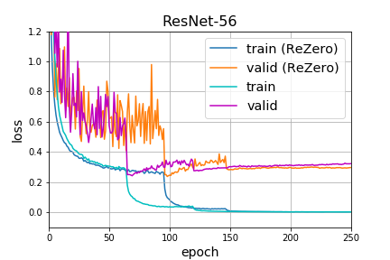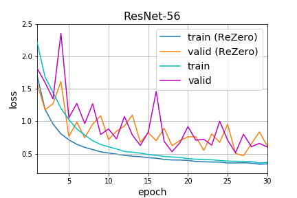

**ResNet-110:**

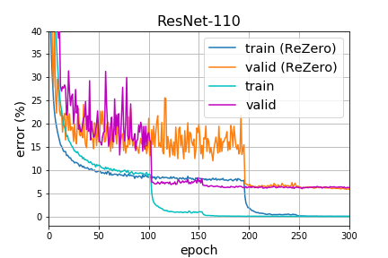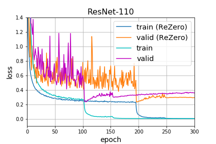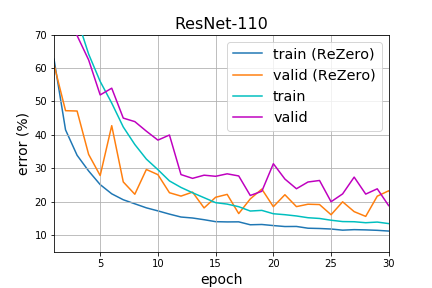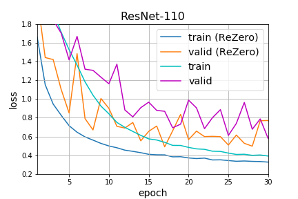

**This repo vs. original ResNet paper:**
| Model     | (paper) Test error (%) | (this repo) Test error (%) |
|:-----------|:-----------------:|:---------------------:|
| ResNet-20 | 8.75 | **7.98** |
| ResNet-56 | 6.97 | **6.44** |
| ResNet-110 | 6.43 | **6.39** |

## Run
You can launch **Distributed** training from `src/` using:

    python -m torch.distributed.launch --nnodes=1 --node_rank=0 --nproc_per_node=2 --use_env main.py

This will train on a single machine (`nnodes=1`), assigning 1 process per GPU where `nproc_per_node=2` refers to training on 2 GPUs. To train on `N` GPUs simply launch `N` processes by setting `nproc_per_node=N`.

The number of CPU threads to use per process is hard coded to `torch.set_num_threads(1)` for safety, and can be changed to `your # cpu threads / nproc_per_node` for better performance.

For more info on **multi-node** and **multi-gpu** distributed training refer to https://github.com/hgrover/pytorchdistr/blob/master/README.md

To train normally using **nn.DataParallel** or using the CPU:

    python main.py --no_distributed

* **Author**: Fabio De Sousa Ribeiro
* **Email**: fdesosuaribeiro@lincoln.ac.uk
